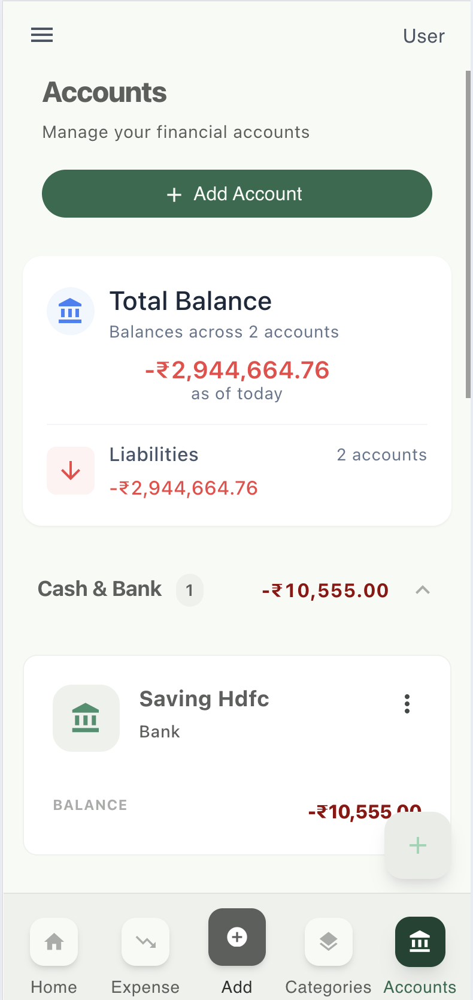
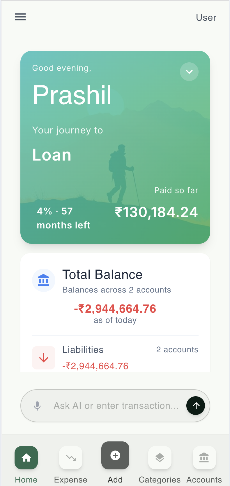
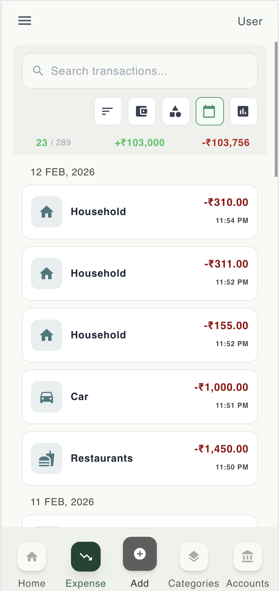

<p align="center">
  
 <div style="display: flex; justify-content: center; margin: 18px 0;">
  <a href="https://prashiln79.github.io/money-manager" target="_blank"
     style="background:#6b7280; color:white; padding:12px 20px; border-radius:8px; text-decoration:none; font-weight:600;">
     🚀 Go to App
  </a>
</div>

</p>
<p align="center">
  
  
  
  
</p>

# Money Manager

**Money Manager** is a production-grade personal finance application designed to help users track, analyze, and optimize their financial life. Built with modern web technologies and a focus on user experience, it offers a seamless, cross-platform experience with offline capabilities and advanced AI-powered interactions.

## 🌟 Key Features

### 🤖 AI Financial Assistant
- **Natural Language Processing**: Simply type or say "Spent 500 on groceries" to instantly record transactions.
- **Voice Commands**: Integrated mic support for hands-free interaction using OpenAI Whisper.
- **Smart Insights**: Ask questions like "How much did I spend on food last month?" to get instant answers.

### 💰 Comprehensive Financial Tools
- **Multi-Account Tracking**: Manage savings, credit cards, and loans in one unified dashboard.
- **Smart Budgeting**: Set monthly spending limits and receive visual alerts when nearing thresholds.
- **Custom Categories**: Organize transactions with flexible, user-defined categories.

### 📊 Analytics & Visualization
- **Dynamic Reports**: Visualize spending habits with interactive ECharts and AmCharts.
- **Cash Flow Analysis**: Track income vs. expenses trends over time.

### 🛠 Technical Excellence
- **Offline-First PWA**: Fully functional offline mode with data synchronization when online.
- **Responsive Design**: Optimized for Desktop, Tablet, and Mobile (iOS/Android).
- **Dark/Light Themes**: Modern UI with Tailwind CSS.

## 🏗 Tech Stack

| Category | Technologies |
|----------|--------------|
| **Frontend Framework** | Angular 18, TypeScript |
| **State Management** | NgRx (Store, Effects, Entity) |
| **UI & Styling** | Angular Material, Tailwind CSS, SCSS |
| **Backend & Auth** | Firebase (Firestore, Auth, Hosting) |
| **AI Integration** | OpenAI GPT-4o API, OpenAI Whisper |
| **Data Visualization** | ECharts, AmCharts |
| **Testing** | Jasmine, Karma |

## 📐 Architecture

The application follows a modular, scalable architecture emphasizing separation of concerns:

- **Facade Pattern**: Acts as an abstraction layer between components and state management, keeping components "dumb" and focused on presentation.
- **Feature Modules**: Logic is split into lazy-loaded modules (`Dashboard`, `Auth`, `Settings`) for optimal performance.
- **Smart vs. Dumb Components**:
    - **Smart Components**: Handle data fetching and business logic (via Facades).
    - **Dumb Components**: Purely presentational, receiving data via `@Input` and emitting events.

## 🚀 Getting Started

### Prerequisites

- Node.js (v18 or higher)
- npm or yarn
- Angular CLI (`npm install -g @angular/cli`)

### Installation

1. **Clone the repository**
   ```bash
   git clone https://github.com/prashiln79/money-manager.git
   cd money-manager
   ```

2. **Install dependencies**
   ```bash
   npm install
   ```

3. **Environment Setup**
    - Create `src/environments/environment.ts` (copy from example if available).
    - Configure your Firebase and OpenAI API keys.

4. **Start the development server**
   ```bash
   npm start
   ```

## ✅ Testing

This project includes comprehensive test coverage (~80%) for all major components.

### Running Tests

```bash
# Run tests in watch mode (development)
npm test

# Run tests once with coverage (CI/CD)
npm run test:ci

# Run tests with detailed coverage report
npm run test:coverage
```

### Test Coverage Goals
- **Statements**: 80%
- **Branches**: 80%
- **Functions**: 80%
- **Lines**: 80%

## 📂 Project Structure

```
src/
├── app/
│   ├── component/dashboard/     # Feature components (Dashboard, Transactions)
│   ├── modules/                 # Lazy-loaded modules and shared modules
│   ├── store/                   # NgRx State (Actions, Reducers, Selectors, Effects)
│   ├── util/                    # Utilities, Services, Guards, Interceptors
│   │   └── service/ai-chat/     # AI Logic (OpenAI, Intent Parsers)
│   └── app.module.ts            # Root module
├── assets/                      # Images, Icons, i18n files
└── environments/                # App configuration variables
```

## 📸 Screenshots

### Dashboard Overview • Budget & Categories • Reports & Analytics

<div style="display: grid; grid-template-columns: repeat(auto-fit, minmax(250px, 1fr)); gap: 16px;">
  
  
  
</div>

## 🤝 Contributing

1. Fork the repository
2. Create your feature branch (`git checkout -b feature/amazing-feature`)
3. Commit your changes (`git commit -m 'Add some amazing feature'`)
4. Push to the branch (`git push origin feature/amazing-feature`)
5. Open a Pull Request

## 📄 License

This project is licensed under the MIT License.
